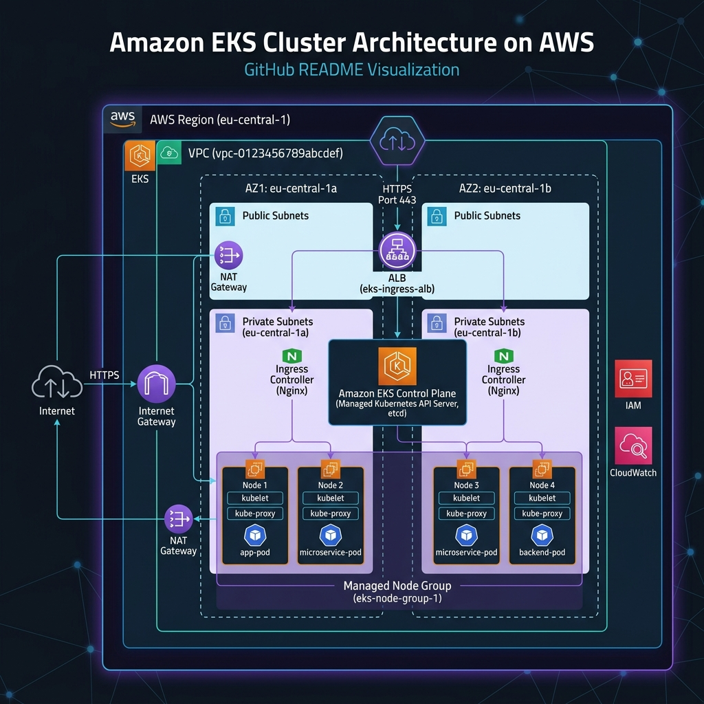

# AWS EKS Infrastructure Automation

This repository contains a collection of hands-on infrastructure projects focused on provisioning, managing, and operating **Amazon EKS (Kubernetes)** using modern DevOps and Infrastructure-as-Code practices.

Each module is organized in its own folder with clear documentation and reproducible steps.

---

## Repository Structure

| Module | Description |
|--------|------------|
| `01-eksctl-cluster/` | Provision an EKS cluster using `eksctl` and a scalable node group |
| `02-aws-eks-nodegroups-spot/` | Manage and scale nodegroups with cost-optimized Spot instances |
| `03-nginx-deployment/` | Deploy a scalable application and expose it using an AWS Load Balancer |
| `04-configmaps-secrets/` | Manage application settings and credentials using ConfigMaps and Secrets |

---

## Tools & Technologies

- Amazon EKS (Kubernetes)
- eksctl
- kubectl
- AWS CLI
- IAM
- EC2 (Node Groups)

---

## Getting Started

### Prerequisites
Before running any module, ensure you have:

- AWS CLI configured (`aws configure`)
- `eksctl` installed
- `kubectl` installed
- Permissions to create EKS resources in AWS

---

## Notes (Security)
- This repository excludes sensitive files such as:
  - `*.pem` (SSH private keys)
  - kubeconfig files
  - terraform state files (if added later)

---

## Author
**Paul Max Chamblain**  
Cloud Infrastructure / DevOps Engineer
